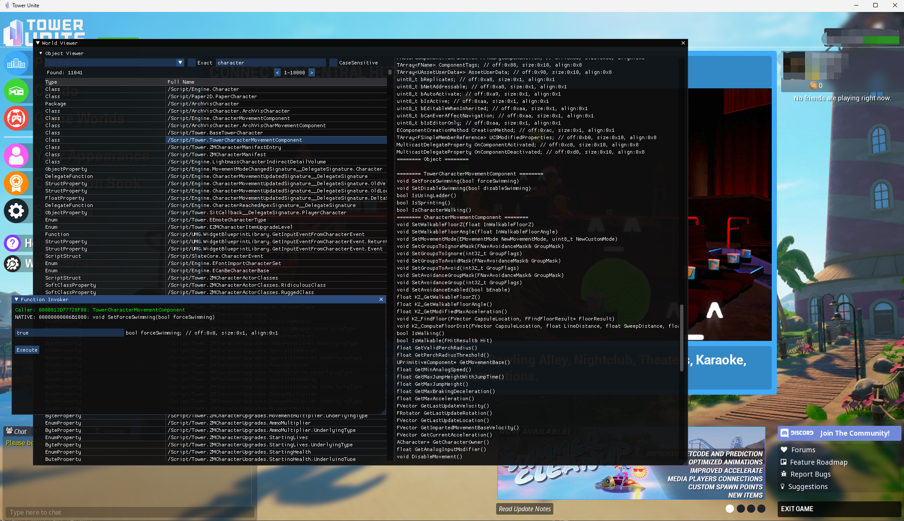

# UEInterceptor

**UNSTABLE DEVELOPMENT PROGRESS**

## Features

* View / Search / Edit / Invoke > **UE World Objects** > Methods / Static Functions / Blueprint / Properties / etc.
* Hot-reload dll for rapid prototype.

*currently only simple UObject Methods Invocation is supported*

## Demo (Right Click -> View Image)

*All respect to the demo game*

## Dang! How to use this?

1. Find an UE game
2. Build UEInterceptor for that game (See next section)
3. Inject compiled UEInterceptor to game
4. Inpect interesting objects using in-game imgui menu provided by UEInterceptor
5. Play with the objects' properties/methods. Get its offsets/attributes in the memu. Even invoke some.
6. Code you standalone tool real quick.

## How do I build & update

1. git clone **--recursive** <THIS REPO>
2. Download source code of Unreal Engine
3. Install DirectX SDK, update variables in `UEInterceptor/EnvSetup.props`
4. Open sln, try to build.
5. Fix UE source error popping up. May be 5 places, more or less.
6. Update patterns in `UnrealInternal.cpp`
7. Build & Inject!

### Credit

- ImGUI: [ocornut/imgui](https://github.com/ocornut/imgui)
- DXHook for ImGUI: [xMajdev/ImGuiHook](https://www.unknowncheats.me/forum/d3d-tutorials-and-source/457178-imgui-hook-directx12-directx11-directx9-x64-x86.html)
- MinHook: [TsudaKageyu/minhook](https://github.com/TsudaKageyu/minhook)
- Kanan's Pattern Scan
